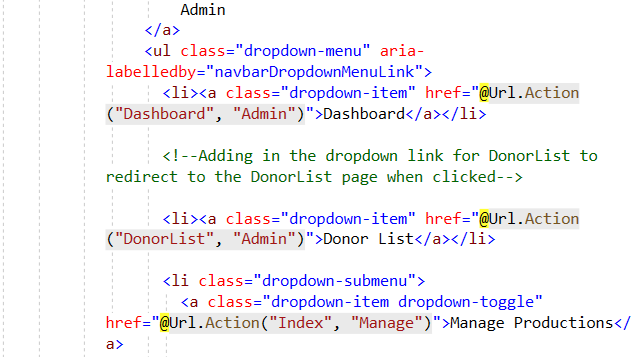
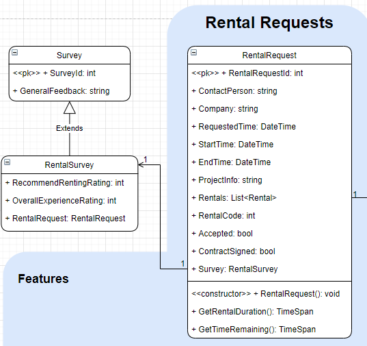
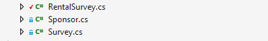
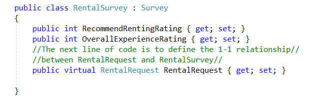
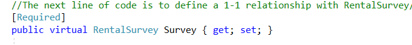

LIVE PROJECT INTERNSHIP OVERVIEW 

Front/Back End Stories
-Donor List Dropdown/ Link to Nav Bar

Adding Donor List Dropdown/ Link Dropdown/ Link to Nav Bar
This story required me to add in a new NavBar section for the currently existing page, Donor List.  The purpose of this was to allow the admin or back end user of this functioning website a quick link to a list of Donors using the NavBar only seen by the admin user.

 
 
 Create Survey Model and CRUD (

This story required me to build a new SurveyModel, and then a secondary RentalSurvey model which was to extend from the SurveyModel using a THP relationship. Additionally,  I needed to create a 1-1 relationship between the existing RentalRequest and the new RentalSurvey models. Lastly, I needed to create a SurveyController that generated CRUD view pages.

Here is an example of the image provided as a launching point:

Step 1: Create new Survey Model and define properties

Step 2: Create a TPH relationship with Rebtal Survey and Survey Model

